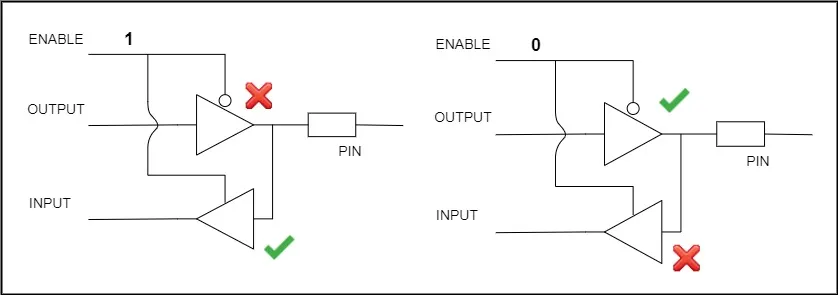

# GPIO Driver

## Introduction

The **General Purpose Input/Output (GPIO)** peripheral allows the microcontroller to interface with external hardware through programmable digital input and output pins.

This project provides a bare-metal GPIO driver implementation for the **STM32F103xx** microcontroller family. The driver is designed to be modular, lightweight, and easy to integrate into embedded applications.

GPIOs are commonly used for:

- Reading digital inputs from switches, sensors, and external devices.
- Driving digital outputs such as LEDs, relays, and actuators.
- Generating external interrupts.
- Triggering external peripherals.
- Configuring Alternate Function (AF) peripherals such as SPI, USART, I²C, Timers, and more.

A GPIO **port** is a collection of GPIO pins grouped together under a single peripheral. On the **STM32F103xx**, each GPIO port consists of **16 programmable GPIO pins (GPIO0–GPIO15)**.

---

# GPIO Buffer Architecture

Internally, every GPIO pin is implemented using an input and output buffer.



The buffer determines whether the pin operates as an input or an output.

- **Enable = 0** → Output buffer is enabled.
- **Enable = 1** → Input buffer is enabled.

---

# Input Mode and High-Impedance (Hi-Z) State

When a GPIO pin is configured as an input, it can be left in a **High-Impedance (Hi-Z)** state.

A High-Impedance state means the pin is electrically disconnected from both the supply voltage (**VDD**) and ground (**GND**). In this state, the pin is said to be **floating**, and its logic level is undefined.

After reset, all GPIO pins on the STM32F103xx are configured as floating inputs by default.

To prevent unpredictable input readings, the GPIO peripheral provides configurable **internal Pull-Up** and **Pull-Down** resistors. External pull-up or pull-down resistors may also be used when required.

---

# Open-Drain Output

In **Open-Drain** mode, the GPIO output stage contains only the pull-down (NMOS) transistor.

Characteristics:

- The GPIO pin can actively drive the output LOW.
- The HIGH level is obtained using either an internal or external pull-up resistor.
- Multiple devices can safely share the same communication line.

Open-Drain outputs are commonly used for communication protocols such as **I²C**, where multiple devices share the same bus.

---

# Push-Pull Output

**Push-Pull** is the default output configuration for STM32 GPIO pins.

In this mode:

- A PMOS transistor actively drives the output HIGH.
- An NMOS transistor actively drives the output LOW.
- No external pull-up resistor is required.

Push-Pull outputs can both **source** and **sink** current, making them suitable for driving LEDs and most digital output applications.

---

# GPIO Driver

The GPIO driver provides a register-level interface for configuring and controlling the General Purpose Input/Output (GPIO) peripherals of the **STM32F103xx** microcontroller.

---

# Features

The GPIO driver supports:

- GPIO pin initialization and configuration
- Digital input and output operations
- Push-Pull and Open-Drain output modes
- Floating, Pull-Up, and Pull-Down input modes
- Alternate Function configuration
- External Interrupt (EXTI) configuration
- NVIC interrupt configuration and priority management
- Peripheral clock control
- Atomic pin set/reset operations using the `BSRR` register

---

# File Overview

| File | Description |
|------|-------------|
| `gpio.h` | GPIO and AFIO register definitions, peripheral mappings, and clock control macros. |
| `gpio_driver.h` | GPIO configuration macros, data structures, and public API declarations. |
| `gpio_driver.c` | Implementation of the GPIO driver APIs. |

---

# gpio.h

This file defines the register layouts of the GPIO and AFIO peripherals and provides macros for accessing peripheral instances and controlling peripheral clocks.

---

## GPIO Register Structure

Each GPIO peripheral has the following register layout.

```c
typedef struct
{
    volatile uint32_t CRL;
    volatile uint32_t CRH;
    volatile uint32_t IDR;
    volatile uint32_t ODR;
    volatile uint32_t BSRR;
    volatile uint32_t BRR;
    volatile uint32_t LCKR;

} GPIO_RegDef_t;
```

### Register Description

| Register | Description |
|----------|-------------|
| **CRL** | Configuration register for pins 0–7 |
| **CRH** | Configuration register for pins 8–15 |
| **IDR** | Input Data Register |
| **ODR** | Output Data Register |
| **BSRR** | Bit Set/Reset Register (atomic bit operations) |
| **BRR** | Bit Reset Register |
| **LCKR** | Port Configuration Lock Register |

The same register structure is mapped to every GPIO peripheral base address.

```c
GPIOA
GPIOB
GPIOC
GPIOD
GPIOE
GPIOF
GPIOG
```

---

## AFIO Register Structure

The Alternate Function I/O (AFIO) peripheral controls GPIO remapping and EXTI source selection.

```c
typedef struct
{
    volatile uint32_t EVCR;
    volatile uint32_t MAPR;
    volatile uint32_t EXTICR[4];
    volatile uint32_t MAPR2;

} AFIO_RegDef_t;
```

### Register Description

| Register | Description |
|----------|-------------|
| EVCR | Event Control Register |
| MAPR | Alternate Function Remap Register |
| EXTICR1–4 | External Interrupt Configuration Registers |
| MAPR2 | Additional Remap Register |

---

## Peripheral Mapping

The register structures are mapped to their peripheral base addresses.

```c
GPIOA
GPIOB
GPIOC
GPIOD
GPIOE
GPIOF
GPIOG

AFIO
```

These macros provide direct access to the peripheral registers.

---

## Peripheral Clock Control

Every GPIO peripheral must have its clock enabled before it can be configured.

### Clock Enable

```c
GPIOA_CLK_EN()
GPIOB_CLK_EN()
GPIOC_CLK_EN()
GPIOD_CLK_EN()
GPIOE_CLK_EN()

AFIO_CLK_EN()
```

### Clock Disable

```c
GPIOA_CLK_DI()
GPIOB_CLK_DI()
GPIOC_CLK_DI()
GPIOD_CLK_DI()
GPIOE_CLK_DI()

AFIO_CLK_DI()
```

---
# gpio_driver.h

This file contains the GPIO driver interface exposed to the application. It defines configuration macros, driver data structures, and the public APIs used to configure and control GPIO peripherals.

---

## GPIO Pin Macros

GPIO pins are identified using pin numbers ranging from **0** to **15**.

```c
GPIO_PIN_0
GPIO_PIN_1
...
GPIO_PIN_15
```

These macros are used to select the GPIO pin during configuration.

---

## AFIO Port Codes

The AFIO peripheral uses port codes to configure the source port for external interrupt (EXTI) lines.

| Port | Code |
|------|------|
| GPIOA | `PA` |
| GPIOB | `PB` |
| GPIOC | `PC` |

---

## GPIO Modes

The STM32F103xx GPIO peripheral supports multiple operating modes.

### Input Modes

| Macro | Description |
|--------|-------------|
| `GPIO_MODE_IP` | Configure the pin as an input. |

---

### Output Modes

| Macro | Description |
|--------|-------------|
| `GPIO_MODE_OP_10MHZ` | Output mode with a maximum speed of 10 MHz |
| `GPIO_MODE_OP_2MHZ` | Output mode with a maximum speed of 2 MHz |
| `GPIO_MODE_OP_50MHZ` | Output mode with a maximum speed of 50 MHz |

---

### Interrupt Modes

| Macro | Description |
|--------|-------------|
| `GPIO_MODE_IT_RT` | Interrupt on Rising Edge |
| `GPIO_MODE_IT_FT` | Interrupt on Falling Edge |
| `GPIO_MODE_IT_RFT` | Interrupt on both Rising and Falling Edges |

---

## GPIO Configuration (CNF)

The **CNF** bits define the electrical behavior of the GPIO pin.

### Input Configuration

| Macro | Description |
|--------|-------------|
| `GPIO_CNF_ANALOG` | Analog mode |
| `GPIO_CNF_FLOATING` | Floating input |
| `GPIO_CNF_INPUT_PUPD` | Pull-Up / Pull-Down input |

---

### Output Configuration

| Macro | Description |
|--------|-------------|
| `GPIO_CNF_GP_PUSH_PULL` | General Purpose Push-Pull |
| `GPIO_CNF_GP_OPEN_DRAIN` | General Purpose Open-Drain |
| `GPIO_CNF_AF_PUSH_PULL` | Alternate Function Push-Pull |
| `GPIO_CNF_AF_OPEN_DRAIN` | Alternate Function Open-Drain |

---

## Pull-Up / Pull-Down Configuration

When the input configuration is set to **Pull-Up/Pull-Down**, the output data register determines whether the internal resistor behaves as a Pull-Up or Pull-Down resistor.

| Macro | Description |
|--------|-------------|
| `GPIO_PIN_PU` | Internal Pull-Up |
| `GPIO_PIN_PD` | Internal Pull-Down |

---

## GPIO_PinConfig_t

This structure stores the configuration parameters of a GPIO pin.

```c
typedef struct
{
    uint8_t GPIO_PinNumber;
    uint8_t GPIO_PinMode;
    uint8_t GPIO_PinCNF;
    uint8_t GPIO_PinPuPdControl;

} GPIO_PinConfig_t;
```

### Members

| Member | Description |
|--------|-------------|
| `GPIO_PinNumber` | GPIO pin number (0–15) |
| `GPIO_PinMode` | Input, Output, or Interrupt mode |
| `GPIO_PinCNF` | Pin configuration (Push-Pull, Open-Drain, Floating, etc.) |
| `GPIO_PinPuPdControl` | Pull-Up or Pull-Down selection |

---

## GPIO_Handle_t

The GPIO Handle combines the GPIO peripheral instance with its configuration.

```c
typedef struct
{
    GPIO_RegDef_t *pGPIOX;
    GPIO_PinConfig_t GPIO_PinConfig;

} GPIO_Handle_t;
```

This structure is passed to the driver during GPIO initialization.

---

# GPIO Driver APIs

The following APIs are provided by the GPIO driver.

---

## GPIO_PeriClockControl()

```c
void GPIO_PeriClockControl(GPIO_RegDef_t *pGPIOx, uint8_t ENorDI);
```

Enables or disables the peripheral clock for a GPIO port.

**Parameters**

- `pGPIOx` – GPIO peripheral
- `ENorDI` – Enable or Disable

---

## GPIO_Init()

```c
void GPIO_Init(GPIO_Handle_t *pGPIOHandle);
```

Initializes a GPIO pin according to the configuration stored in the `GPIO_Handle_t` structure.

This API configures:

- GPIO mode
- Output speed
- Pin configuration
- Pull-Up/Pull-Down resistors
- Alternate Function configuration
- External Interrupt (EXTI), if selected

---

## GPIO_DeInit()

```c
void GPIO_DeInit(GPIO_RegDef_t *pGPIOx);
```

Resets all registers of the selected GPIO peripheral using the RCC reset register.

---

## GPIO_ReadFromInputPort()

```c
uint16_t GPIO_ReadFromInputPort(GPIO_RegDef_t *pGPIOx);
```

Reads the logic levels of all 16 GPIO pins simultaneously.

**Returns**

16-bit input port value.

---

## GPIO_ReadFromInputPin()

```c
uint8_t GPIO_ReadFromInputPin(GPIO_RegDef_t *pGPIOx, uint8_t PinNumber);
```

Reads the logic level of a single GPIO pin.

**Returns**

- `0` → LOW
- `1` → HIGH

---

## GPIO_WriteToOutputPort()

```c
void GPIO_WriteToOutputPort(GPIO_RegDef_t *pGPIOx, uint16_t value);
```

Writes a 16-bit value directly to the GPIO Output Data Register (ODR).

---

## GPIO_WriteToOutputPin()

```c
void GPIO_WriteToOutputPin(GPIO_RegDef_t *pGPIOx,
                           uint8_t PinNumber,
                           uint8_t value);
```

Sets or clears an individual GPIO output pin.

This API uses the **BSRR** register to perform atomic bit operations.

---

## GPIO_ToggleOutputPin()

```c
void GPIO_ToggleOutputPin(GPIO_RegDef_t *pGPIOx,
                          uint8_t PinNumber);
```

Toggles the output state of the selected GPIO pin.

---

## GPIO_IRQInterruptConfig()

```c
void GPIO_IRQInterruptConfig(uint8_t IRQNumber,
                             uint8_t ENorDI);
```

Enables or disables a GPIO interrupt in the Nested Vectored Interrupt Controller (NVIC).

---

## GPIO_IRQPriorityConfig()

```c
void GPIO_IRQPriorityConfig(uint32_t IRQPriority,
                            uint8_t IRQNumber);
```

Configures the priority of a GPIO interrupt.

Lower priority values correspond to higher interrupt priorities.

---

## GPIO_IRQHandling()

```c
void GPIO_IRQHandling(uint8_t PinNumber);
```

Handles a GPIO interrupt by clearing the corresponding pending bit in the EXTI Pending Register (PR).

---

# Typical Initialization Flow

A typical GPIO initialization sequence is shown below.

```text
Enable GPIO Peripheral Clock
            │
            ▼
Configure GPIO_Handle_t
            │
            ▼
Call GPIO_Init()
            │
            ▼
Read / Write / Toggle GPIO
            │
            ▼
(Optional)
Configure EXTI + NVIC
```

---

# Example

The following example configures **PC13** as a Push-Pull output and continuously toggles its state.

```c
GPIO_Handle_t led;

led.pGPIOX = GPIOC;

led.GPIO_PinConfig.GPIO_PinNumber = GPIO_PIN_13;
led.GPIO_PinConfig.GPIO_PinMode = GPIO_MODE_OP_2MHZ;
led.GPIO_PinConfig.GPIO_PinCNF = GPIO_CNF_GP_PUSH_PULL;

GPIO_Init(&led);

while (1)
{
    GPIO_ToggleOutputPin(GPIOC, GPIO_PIN_13);
}
```

---

# Notes

- Enable the GPIO peripheral clock before accessing any GPIO registers.
- Configure the GPIO mode before reading from or writing to a pin.
- Use the **BSRR** register for atomic pin set/reset operations.
- Enable the **AFIO** clock before configuring EXTI lines.
- Configure the NVIC separately when using GPIO interrupts.
- Ensure the selected GPIO mode and configuration are compatible with the intended application.

---

# References

- **STM32F103xx Reference Manual (RM0008)**
- **STM32F103xx Datasheet**
- **ARM Cortex-M3 Technical Reference Manual**