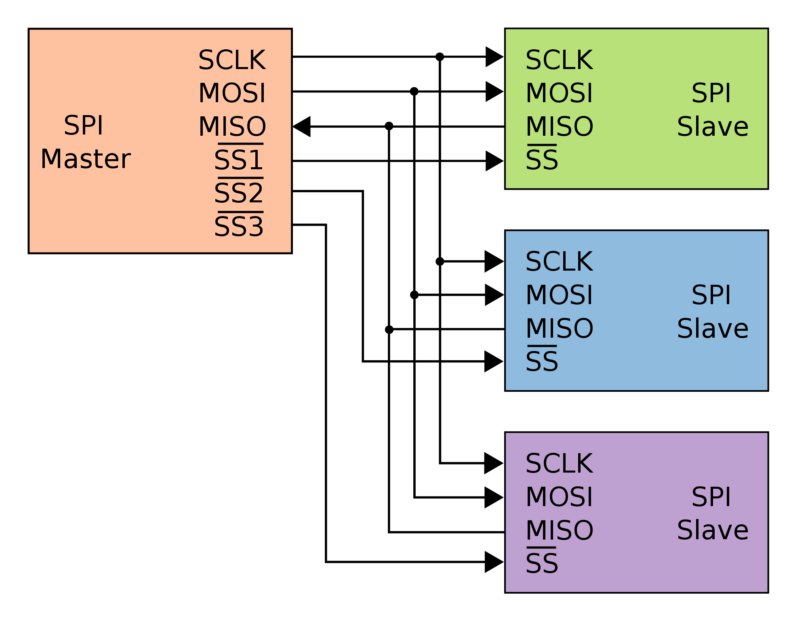
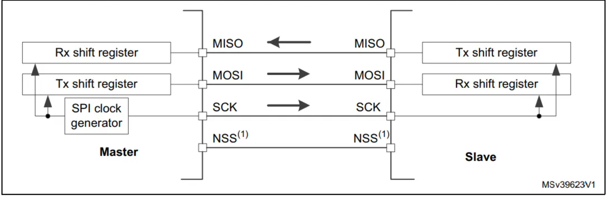
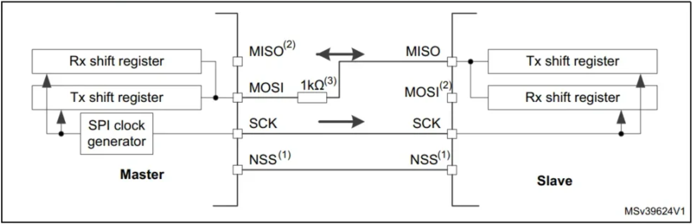
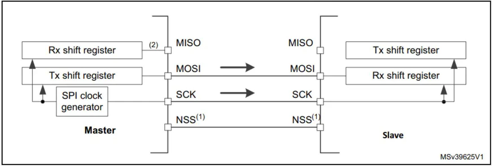
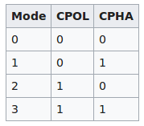

#SPI Driver

# SPI Driver

A bare-metal SPI driver implementation for the STM32F103xx microcontroller family.

---

# Table of Contents

1. SPI Protocol
   - Introduction
   - SPI Signals
   - SPI Bus Configuration
   - Communication Modes
     - Full-Duplex
     - Half-Duplex
     - Simplex
   - Slave Management
   - NSS (Slave Select) Management
   - SPI Communication Format
   - Clock Polarity (CPOL)
   - Clock Phase (CPHA)
   - SPI Modes

2. SPI Driver
   - Driver Overview
   - `spi.h`
   - `spi_driver.h`
   - SPI Register Structure
   - Peripheral Clock Control
   - SPI Configuration Structure
   - SPI Handle Structure
   - SPI APIs
   - Interrupt APIs
   - Driver Workflow
   - Example

---

# Part 1 — SPI Protocol

## Introduction

The **Serial Peripheral Interface (SPI)** is a synchronous serial communication protocol used for high-speed communication between a **Master** device and one or more **Slave** devices.

This project provides a bare-metal SPI driver implementation for the **STM32F103xx** microcontroller family. The driver is designed to be modular, lightweight, and easy to integrate into embedded applications.



---

## SPI Signals

SPI communication uses four dedicated signals.

| Signal | Description |
|---------|-------------|
| **MOSI (Master Out Slave In)** | Carries data from the Master to the Slave. |
| **MISO (Master In Slave Out)** | Carries data from the Slave to the Master. |
| **SCLK (Serial Clock)** | Clock generated by the Master to synchronize communication. |
| **NSS (Slave Select / Chip Select)** | Used by the Master to select a Slave device. |

---

## SPI Bus Configuration

An SPI bus generally consists of:

- One Master device
- One or more Slave devices
- Shared MOSI, MISO and SCLK lines
- A dedicated NSS line for each Slave

For certain applications, SPI can operate with only:

- One Clock line
- One Data line

depending on the selected communication mode.

---

## Communication Modes

### Full-Duplex Communication

Full-duplex mode uses separate transmit and receive lines.

Characteristics:

- Master transmits on **MOSI**
- Slave transmits on **MISO**
- Simultaneous transmission and reception
- Default SPI operating mode



---

### Half-Duplex Communication

Half-duplex mode uses a single bidirectional data line.

Characteristics:

- One shared data line
- One-direction communication at any instant
- Master and Slave alternate between transmitting and receiving



---

### Simplex Communication

Simplex communication supports one-way data transfer.

Typical configuration:

- Master → Transmitter
- Slave → Receiver

Although the wiring is identical to Full-Duplex mode, one data line is ignored and may optionally be configured as a GPIO.



---

## Slave Management

STM32 SPI peripherals support two slave management modes.

### Hardware Slave Management (SSM = 0)

The NSS signal is managed by hardware.

**Master Mode**

- NSS must be configured as an output.
- Used to select the target Slave.

**Slave Mode**

- Communication begins when NSS is driven LOW.

Hardware slave management is recommended for systems with multiple Slave devices.

---

### Software Slave Management (SSM = 1)

The NSS signal is internally driven using the **SSI** bit of the `SPI_CR1` register.

Advantages:

- External NSS pin becomes available for GPIO usage.
- Simplifies single Master–single Slave applications.

> **Note:** Software slave management cannot be used when the Master must individually select multiple Slave devices.

---

## NSS (Slave Select) Behavior

### Slave Mode

- NSS LOW → Slave is selected.
- NSS HIGH → Slave ignores SPI communication.

### Master Mode

NSS may be configured as:

- Output — Drives the Slave Select signal.
- Input — Detects multi-master bus collisions.

---

## SPI Communication Format

SPI is a synchronous communication protocol.

During every clock cycle:

- One bit is transmitted.
- One bit is received.

The Serial Clock (**SCLK**) synchronizes data transfer.

For successful communication, both Master and Slave must use identical:

- Clock Polarity (CPOL)
- Clock Phase (CPHA)
- Data Frame Format

---

## Clock Polarity (CPOL)

CPOL determines the idle state of the clock.

| CPOL | Clock Idle State |
|------|------------------|
| 0 | Clock remains LOW |
| 1 | Clock remains HIGH |

---

## Clock Phase (CPHA)

CPHA determines when data is sampled.

| CPHA | Sampling Edge |
|------|---------------|
| 0 | Leading edge |
| 1 | Trailing edge |

---

## SPI Modes

The combination of CPOL and CPHA defines four SPI modes.

| Mode | CPOL | CPHA |
|------|------|------|
| Mode 0 | 0 | 0 |
| Mode 1 | 0 | 1 |
| Mode 2 | 1 | 0 |
| Mode 3 | 1 | 1 |



---
# Part 2 — SPI Driver

The SPI driver provides a register-level interface for configuring and controlling the **SPI peripherals** of the STM32F103xx microcontroller family.

---

# Features

The SPI driver currently supports:

- SPI peripheral initialization
- Master and Slave mode configuration
- Full-Duplex, Half-Duplex and Simplex communication
- Configurable clock polarity (CPOL)
- Configurable clock phase (CPHA)
- Configurable baud rate
- 8-bit and 16-bit data frame formats
- Peripheral clock control
- Blocking (Polling) data transmission
- Blocking (Polling) data reception
- Peripheral enable/disable
- Software Slave Management (SSI)
- Peripheral reset (De-initialization)

> **Note:** Interrupt-driven APIs are declared but are not yet implemented.

---

# File Overview

| File | Description |
|------|-------------|
| `spi.h` | SPI register definitions, peripheral mappings, clock control macros, and IRQ definitions. |
| `spi_driver.h` | SPI configuration macros, data structures, and public API declarations. |
| `spi_driver.c` | Implementation of the SPI driver APIs. |

---

# spi.h

The `spi.h` file defines the register layout of the SPI peripheral and provides peripheral mappings and clock control macros.

---

## SPI Register Structure

Each SPI peripheral exposes the following registers.

```c
typedef struct
{
    volatile uint32_t CR1;
    volatile uint32_t CR2;
    volatile uint32_t SR;
    volatile uint32_t DR;
    volatile uint32_t CRCPR;
    volatile uint32_t RXCRCR;
    volatile uint32_t TXCRCR;
    volatile uint32_t I2SCFGR;
    volatile uint32_t I2SPR;

} SPI_RegDef_t;
```

### Register Description

| Register | Description |
|----------|-------------|
| **CR1** | Control Register 1 |
| **CR2** | Control Register 2 |
| **SR** | Status Register |
| **DR** | Data Register |
| **CRCPR** | CRC Polynomial Register |
| **RXCRCR** | RX CRC Register |
| **TXCRCR** | TX CRC Register |
| **I2SCFGR** | I²S Configuration Register |
| **I2SPR** | I²S Prescaler Register |

---

## Peripheral Mapping

The register structure is mapped to each SPI peripheral.

```c
SPI1
SPI2
SPI3
```

These macros provide direct access to the SPI registers.

---

## Peripheral Clock Control

Before configuring or using an SPI peripheral, its clock must be enabled.

### Clock Enable

```c
SPI1_CLK_EN()
SPI2_CLK_EN()
SPI3_CLK_EN()
```

### Clock Disable

```c
SPI1_CLK_DI()
SPI2_CLK_DI()
SPI3_CLK_DI()
```

---

## SPI Interrupt Numbers

The following IRQ numbers are used when configuring the NVIC.

| Peripheral | IRQ Number |
|------------|-----------:|
| SPI1 | 35 |
| SPI2 | 36 |
| SPI3 | 51 |

---

# spi_driver.h

The `spi_driver.h` file defines the SPI configuration structures, configuration macros, and the public driver APIs used by the application.

> This file also provides all configuration options required to initialize the SPI peripheral.

---

# SPI Driver APIs

The following APIs are currently implemented.

---

## SPI_PeriClockControl()

```c
void SPI_PeriClockControl(SPI_RegDef_t *pSPIx,
                          uint8_t ENorDI);
```

Enables or disables the clock for the selected SPI peripheral.

### Parameters

- `pSPIx` — SPI peripheral.
- `ENorDI` — `ENABLE` or `DISABLE`.

---

## SPI_Init()

```c
void SPI_Init(SPI_Handle_t *pSPIHandle);
```

Initializes the SPI peripheral according to the user configuration.

This API configures:

- Device mode (Master/Slave)
- Bus configuration
- Baud rate
- Data frame format
- Clock polarity (CPOL)
- Clock phase (CPHA)

The peripheral clock is automatically enabled before configuration.

---

## SPI_PeripheralControl()

```c
void SPI_PeripheralControl(SPI_RegDef_t *pSPIx,
                           uint8_t ENorDI);
```

Enables or disables the SPI peripheral by controlling the **SPE** bit in the `CR1` register.

---

## SPI_SSIConfig()

```c
void SPI_SSIConfig(SPI_RegDef_t *pSPIx,
                   uint8_t ENorDI);
```

Configures the **SSI (Internal Slave Select)** bit.

This API is primarily used when **Software Slave Management (SSM)** is enabled to prevent **Mode Fault (MODF)** errors during Master operation.

---

## SPI_DeInit()

```c
void SPI_DeInit(SPI_RegDef_t *pSPIx);
```

Resets all SPI registers to their default reset values using the RCC peripheral reset registers.

---

## SPI_SendData()

```c
void SPI_SendData(SPI_RegDef_t *pSPIx,
                  uint8_t *pTxBuffer,
                  uint32_t len);
```

Transmits data over SPI in **blocking (polling)** mode.

### Features

- Waits until the TX buffer becomes empty.
- Supports both **8-bit** and **16-bit** data frame formats.
- Returns only after all requested bytes have been transmitted.

---

## SPI_ReceiveData()

```c
void SPI_ReceiveData(SPI_RegDef_t *pSPIx,
                     uint8_t *pRxBuffer,
                     uint32_t len);
```

Receives data over SPI in **blocking (polling)** mode.

### Features

- Waits until data is available in the RX buffer.
- Supports both **8-bit** and **16-bit** data frame formats.
- Returns only after all requested bytes have been received.

---

## Interrupt APIs

The following APIs have been declared for future interrupt-driven SPI communication.

### SPI_IRQInterruptConfig()

Configures the SPI interrupt in the NVIC.

---

### SPI_IRQPriorityConfig()

Configures the interrupt priority.

---

### SPI_IRQHandling()

Handles SPI interrupt events and clears interrupt flags.

> These APIs are currently placeholders and will be implemented in a future update.

---

# Typical Initialization Flow

A typical SPI initialization sequence is shown below.

```text
Enable SPI Clock
        │
        ▼
Configure SPI_Handle_t
        │
        ▼
Call SPI_Init()
        │
        ▼
(Optional)
Configure Software NSS (SSI)
        │
        ▼
Enable SPI Peripheral
        │
        ▼
Transmit / Receive Data
```

---

# Example

```c
SPI_Handle_t spi1;

spi1.pSPIX = SPI1;

spi1.SPIConfig.SPI_DeviceMode = SPI_DEVICE_MODE_MASTER;
spi1.SPIConfig.SPI_BusConfig  = SPI_BUS_CONFIG_FD;
spi1.SPIConfig.SPI_SclkSpeed  = SPI_SCLK_SPEED_DIV8;
spi1.SPIConfig.SPI_DFF        = SPI_DFF_8;
spi1.SPIConfig.SPI_CPOL       = SPI_CPOL_LOW;
spi1.SPIConfig.SPI_CPHA       = SPI_CPHA_LOW;

SPI_Init(&spi1);

SPI_SSIConfig(SPI1, ENABLE);

SPI_PeripheralControl(SPI1, ENABLE);
```

---

# Notes

- Enable the SPI peripheral clock before using the SPI registers.
- Configure all SPI parameters before enabling the peripheral.
- Both Master and Slave must use identical communication settings (CPOL, CPHA, frame format, etc.).
- For Software Slave Management, configure the SSI bit before enabling the SPI peripheral.
- `SPI_SendData()` and `SPI_ReceiveData()` are blocking APIs and poll the status register until the operation completes.

---

# References

- **STM32F103xx Reference Manual (RM0008)**
- **STM32F103xx Datasheet**
- **ARM Cortex-M3 Technical Reference Manual**