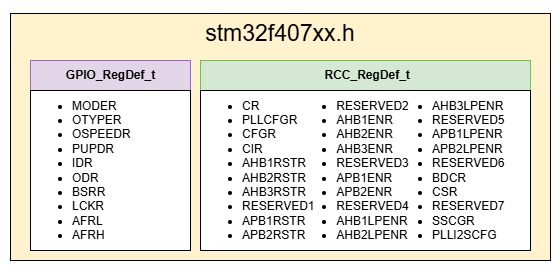
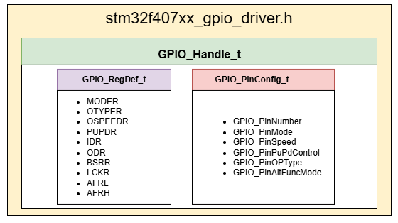

[⬅️ Back to GPIO programming structre and registers](./GPIO%20programming%20structre%20and%20registers.md)
[⬅️ Back to README](../README.md)

# GPIO Driver Structres

## Introduction
This documentation explains the different structures implemented in the header files, making it easier for users to use them in APIs and access peripherals efficiently.

## stm32f407xx.h
In the stm32f407xx.h file, two important structures are defined:

- GPIO_RegDef_t: This structure groups all the registers related to GPIO (General Purpose Input/Output) like MODER, OTYPER, PUPDR, IDR, etc.
Using this structure, users can easily configure and control GPIO pins without manually dealing with individual register addresses.

- RCC_RegDef_t: This structure contains all the RCC (Reset and Clock Control) registers like CR, AHB1ENR, APB1ENR, etc.
It helps users manage clock settings and reset peripherals by directly accessing RCC registers through this organized structure.

## stm32f407xx_gpio_driver.h
In the stm32f407xx_gpio_driver.h file, these structures are defined to help manage GPIOs:

- GPIO_PinConfig_t:This structure holds all the settings for a single GPIO pin. It includes:
    - Pin number
    - Pin mode (input, output, alternate function, analog)
    - Output speed
    - Pull-up/Pull-down configuration
    - Output type (push-pull or open-drain)
    - Alternate function mode (if needed)

- GPIO_Handle_t: This is a "manager" structure that combines:
    - A pointer to the GPIO port registers (GPIO_RegDef_t), like GPIOA, GPIOB, etc.
    - A pin configuration structure (GPIO_PinConfig_t) that tells how to set up the pin.

## Usage
Instead of manually writing register addresses, users can simply create a pointer to these structures (e.g., GPIOA, RCC) and access or modify the required register fields easily, improving code readability and making driver development faster and cleaner.

[⬅️ Back to README](../README.md)
