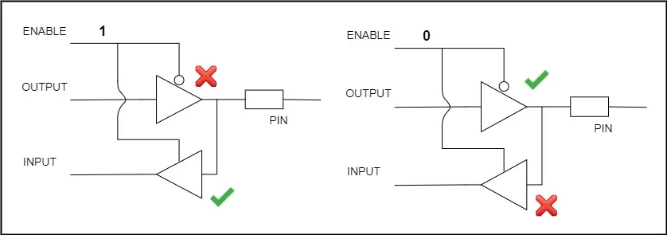
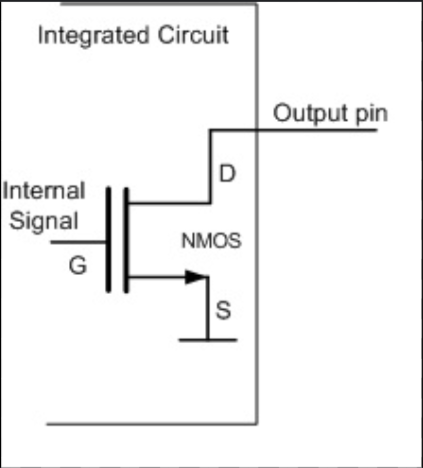
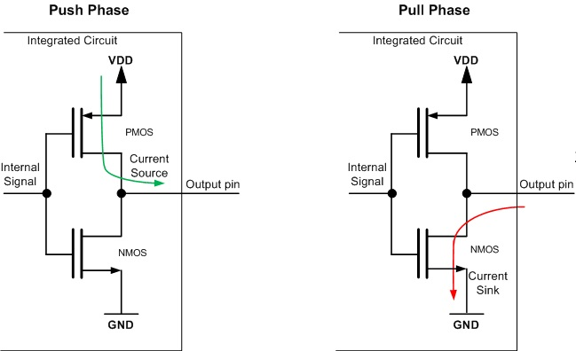

[⬅️ Back to README](../README.md)

# GPIO

## Introduction

This project provides a driver implementation for the GPIO (General Purpose Input Output) on STM32 microcontrollers. It is designed to be modular, efficient, and easy to integrate into your projects.
- GPIOs are mainly used for Reading digital signals, generating triggers for external components, issuing interrupts and many more.
- GPIO port is nothinng but a collection of fixed number of I/O pins.
- in STM32, each port has 16 GPIO pins.

### GPIO Buffer
- GPIO in a microcontroller is implemented as a buffer.

- When Enable is 0, the output buffer is activated and when Enable is 1, the input buffer is activated.

### Input mode with high impedence state
- High Impendence State or HI-Z state of an I/O pin is keeping pin floating by not connecting any input (either high voltage or low voltage).
- When you power up the MUC, all the pins are by default in HI-Z or floating state.
- Floating state is avoided by introducing an internal pull-up or pull-down resistor.
- There are configuration registers for every GPIO port which enable you to handle internal pull-up or pull-down resistors.

### Open Drain Configuration
 
 - Another GPIO pin configuration is an open drain mode, where a pull-up PMOS network is absent. 
 - In this case we need to add an internal or external pull-up resistor to pull the pin, pull-down is handled by the NMOS.
 - Internal pull-up resistor has a fixed value where as external pull-up resistor can vary according to users requirement.

### Push Pull Configuration
 
 - This is the default configuration when the pin is made an output pin.
 - Output will be pulled actively between high and low by using these two transistors.

[➡️ Next: GPIO programming structre and registers](./GPIO%20programming%20structre%20and%20registers.md) 
[⬅️ Back to README](../README.md)