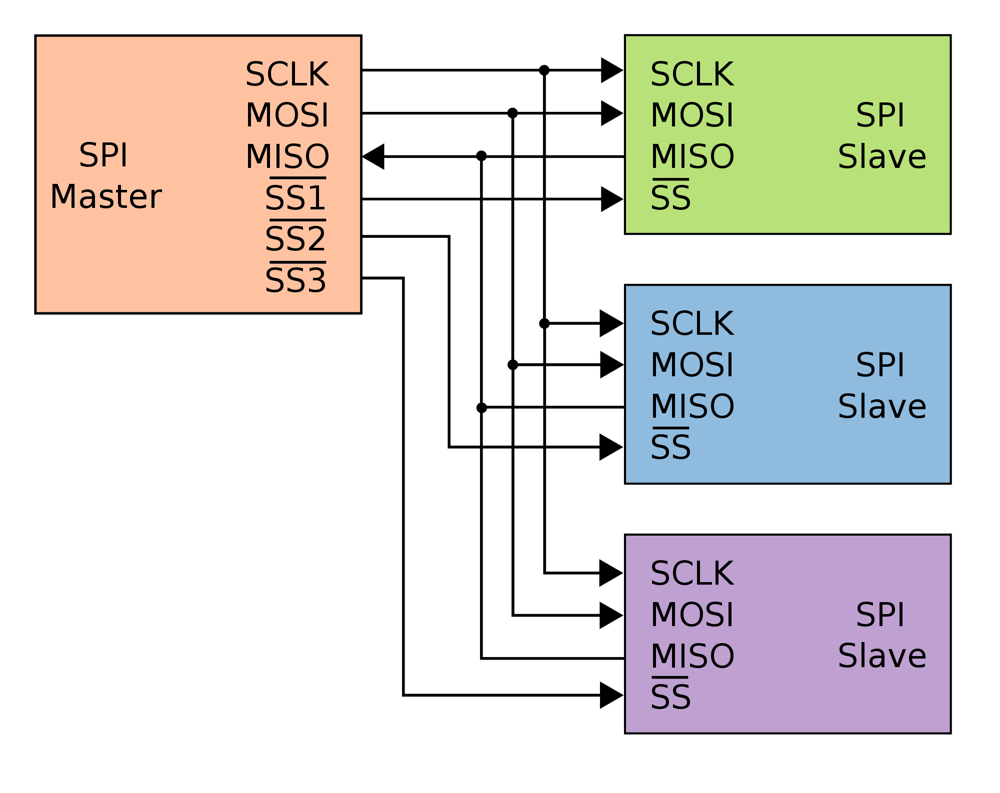
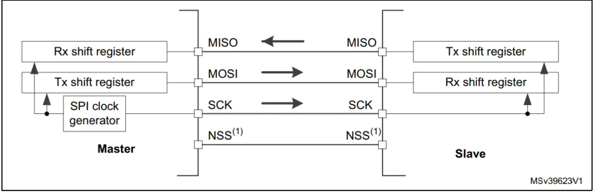
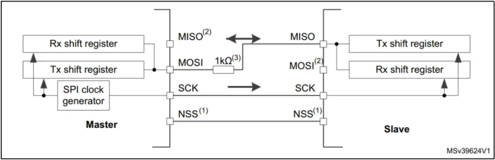
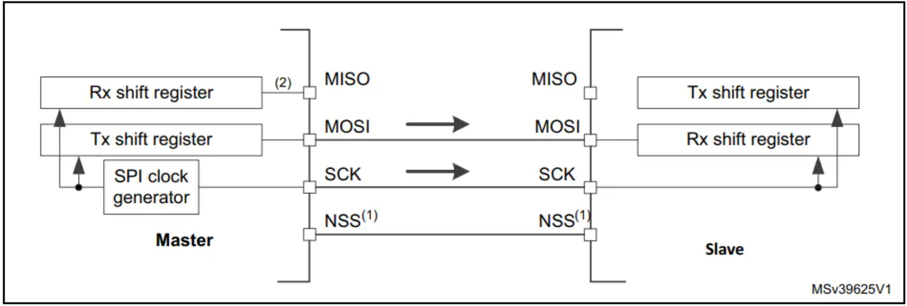

# SPI Protocol

## Introduction

This project provides a driver implementation for the SPI (Serial Peripheral Interface) protocol on STM32 microcontrollers. It is designed to be modular, efficient, and easy to integrate into your projects.

- Four I/O pins are dedicated to SPI comunication with external devices.  
	- MISO: Master In / Slave Out data. In genereal this pin is used to transmit data in slave mode and recieve data in master mode.
	- MOSI: Master Out / Slave In data.  In genereal this pin is used to transmit data in master mode and recieve data in slave mode.
	- SCLK: Serial Clock output pin for SPI master and input pin for SPI slave.
	- NSS: Slave Select pin. Depending on the SPI settings, this pin can be used to  select individual  slave device for communication.

- Minimal SPI Bus Configuration:
	-  SPI bus allows communication between single Master and multiple Slave devices.
	- In some applications SPI bus may consists of just 2 wires - one for the clock signal and other for synchronous data transfer.

## Customizing SPI Bus: Bus Configutarions

SPI allows the MCU to comunicate using different configurations, depending on the devices targeted and the application requirements.
#### Full-Duplex Communication:
-  In this configuration, the shift registers of Master and Slave are linked using two unidirectional lines between the MOSI and MISO pins.
- During the commmunication the data is shifted sychronously on the SCLK clock edges, provided by the Master.
- The Master transmits the data to slave via MOSI line and recieves data from the slave via the MISO line.
- By default SPI is configured in full-duplex mode.

#### Half-Duplex Communication:
- In this configuration a single corss connection line is used between the shift registers of Master and Slave together. 
- During the communication the data is synchronously shifted between the registers on the SCLK edges in the transfer direction selected reciprocally by both Master and Slave (at a time Master can be Tx and Slave be Rx and vice versa).  

#### Simplex Communication:
- Single Master and Single Slave application (Master in Tx and Slave in Rx only modes).
- The cofiguration is same as Full-duplex mode. The application has to ignore the information captured on the unused input pin. This pin can be used as a standard GPIO.

