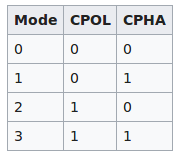

# SPI Operation and Control

## Introduction
This section outlines key aspects of SPI operation, including slave management, NSS pin behavior, and communication format details such as CPOL and CPHA.

## Slave Management

- There are two types of slave management: Hardware Slave Management and Software Slave Management.
- Hardware or software slave select management can be set using the SSM bit in the SPIx_CR1 register.
- Software NSS Management (SSM = 1): In this configuration, slave select information is driven internally by the SSI bit value in register SPIx_CR1. The external NSS pin is free for other application uses.
- Hardware NSS Management (SSM = 0): For Master NSS pin must be in output mode. On Slave this pin must be pulled low to activate communication with Master.
- For example, in single Master and multiple Slave application, we cannot use software NSS management, as Master needs to select the Slave by pulling the Slave's NSS to low.  
### Slave Select (NSS) Pin Management
- When a device is in Slave mode: In Slave mode, the NSS works as standard "chip select"  input and lets slave commuincate with Master.
- When a device is in Master mode: In Master mode, NSS can be either used as output or input. As an input it can prevent multi-master bus collision, and as an output it can drive a slave select signal of a single slave.

## SPI Communication Format
- During SPI communication, recieve and transmit operations are performed simultaneously.
- The serial clock (SCLK) synchronizes the shifting and sampling of the information on the data lines.
- The communication format depends on the clock phase, the clock polarity and data frame format. To be able to commuincate together, the Master and Slave must follow same communication format.

### CPOL (Clock Polarity)
- CPOL bit controls the idle state value of the clock when no data is beign transferred.
- If CPOL is reset (0), the SCLK has a low level idle state (clock will be low for idle states). If CPOL is set (1), the SCLK has a high level idel state (clock will be high for idle state).

### CPHA (Clock Phase)
- CPHA controls at which clock edge of the SCLK (1st or 2nd) the data should be sampled by Slave.
- The combination of CPOL and CPHA bit selects the data capture clock edge.
- CPHA = 1: Data will be sampled on trailing edge of the clock.
- CPHA = 0: Data will be sampled on the leading edge of the clock.

### SPI modes:

