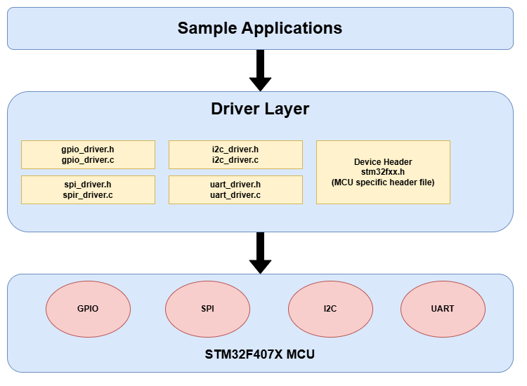

# STM32 Driver Development

## Introduction
In embedded programming, it's helpful to organize code so it's easy to understand and reuse. For this, we use a layered structure to write drivers for STM32F407X peripherals like GPIO, SPI, and UART.

In this setup, the application uses simple functions from the driver layer, which handles all the hardware-level work using register addresses from the device header file.

This makes our code clean, easy to use, and easier to update in future projects.

### Sample Applications (Top Layer)
- This is where user applications live.
- These are high-level programs that use drivers to interact with hardware.
- For example, blinking an LED, reading a sensor via I2C, sending data through UART, etc.

### Driver Layer (Middle Layer)
- This is the core layer where all the low-level code to control peripherals is written.
- It includes:
			- gpio_driver.h/.c: GPIO driver
			- spi_driver.h/.c: SPI driver
			- i2c_driver.h/.c: I2C driver
			- uart_driver.h/.c: UART driver
			- stm32f4xx.h: The MCU-specific device header file that includes base addresses, register definitions, and memory mappings for STM32F407.
- These drivers provide APIs for applications to interact with hardware without worrying about low-level register manipulations.

### STM32F407X MCU (Bottom Layer)
- This is the actual hardware layer of the STM32F407 microcontroller.
- It includes the real peripherals: GPIO, SPI, I2C, UART
- The driver layer communicates directly with the registers of these peripherals using base addresses and register structures.